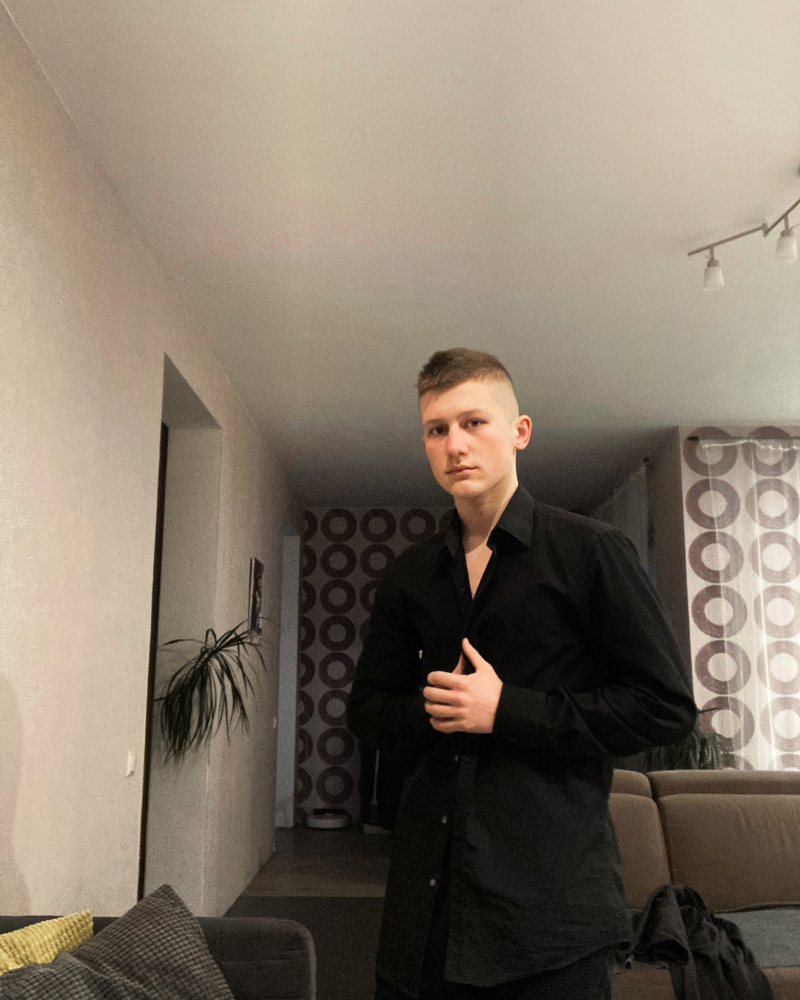

<html lang="en">
  <head>
    <meta charset="utf-8">
    <link type="text/css" rel="stylesheet" href="md.css">
    <title>CV</title>
  </head>
  <body>
   

    <header> 
      <h1>Anton Filuta</h1>
      
    </header>  
    <main>
      <h2>Contacts</h2>
      <ul>
        <li>Phone-Number: +375299277775</li>
        <li>Telegram: @antonfiluta</li>
        <li>VK: antonfiluta</li>
      </ul>
    </main>
    
I have good marks, really like frontend. I would like to be a frontender in future

    
I know HTML, CSS and a liitle Python. I make some projects for school.

    <pre>
      <code>
      
//css-code

  header {
  position: fixed;
  top: 0;  
  box-shadow: 1px 2px 5px 2px;
  width: 100%;
  background-color: #aaa;
  font-family: Gill Sans;
  margin-left: -0.5%;}
      </code>
    </pre>
    
Before I was on two courses of Frontend. Now I study at school

    
My English lvl is aboute A2

    <footer>
     <nav>
      <h2>Links<h2>
      <ul>
        <li><a href="https://github.com/antonfiluta">GitHub</a></li>
        <li>Date:17.12.2022</li>
        <li><a href="https://rs.school/js/">link to course</a></li>
        <li></li>
      </ul> 
     <nav>   
    </footer>
   

  </body>
</html>
